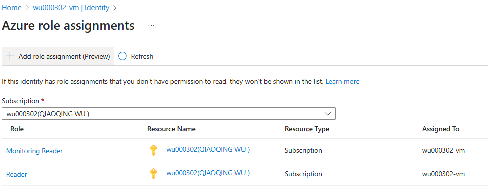
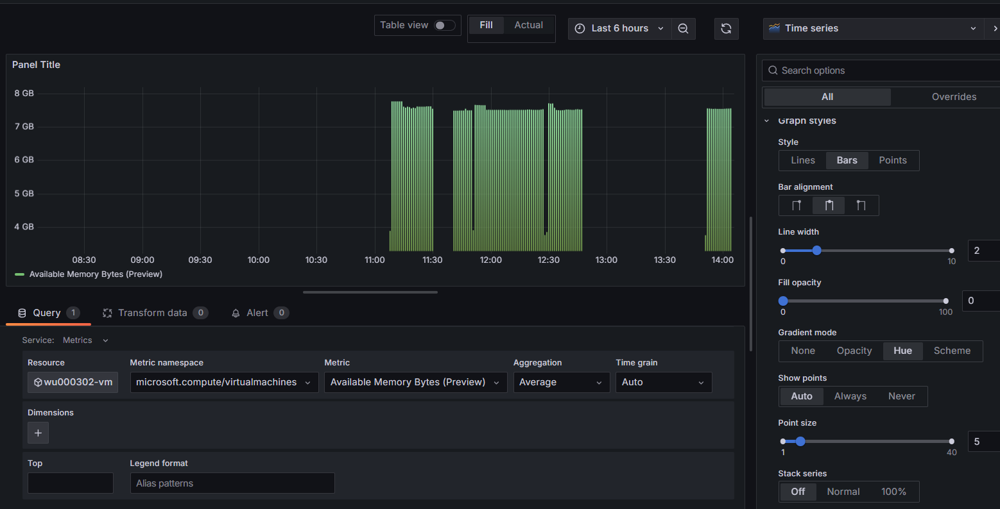

# cst8919-lab3-grafana
Student Name: Qiaoqing Wu (wu000302@algonquinlive.com)

## Step - 1
Create an Azure Virtual Machine with Ubuntu 22.04 server and size Standard B2s v2.

## Step - 2
After installing the Grafana Server in the Azure VM, verified that the Grafana service is running.

## Step - 3
Enable port 3000 in the VM's network configuration.

## Step - 4
Verified that the Grafana Server is accessible.

## Step - 5
Enabled Managed Identity and assigned "Monitoring Reader" and "Reader" roles to the VM.
 
## Step - 6
Enabled Managed Identity authentication to for data source.

## Step - 7
Added the "Azure Monitor" data source using Managed Identity.

## Step - 8
Created a dashboard in Grafana, virtualized relevant metrics, and customized the panels.

